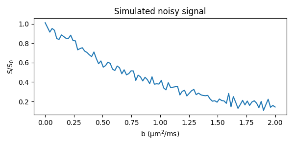

*********
tensorsim
*********

This repository contains a simple tool for generating synthetic data of
multidimensional diffusion MRI experiments.

Installation
############

Clone this repository and install with pip

    pip install .

Use example
###########

    >>> import tensorsim as ts
    >>> import numpy as np
    >>> import matplotlib.pyplot as plt
    >>> N = 100
    >>> bs = np.linspace(1, 2e9, N)
    >>> D = ts.generate_axisymmetric_tensor(FA=.75, MD=1e-9)
    >>> S = np.zeros(N)
    >>> for i, b in enumerate(bs):
            bten = ts.generate_b_tensor('spherical', b)
            S[i] = ts.synthetic_measurement(bten, D)
    >>> S = ts.add_noise_to_data(S, SNR=30)
    >>> fig, ax = plt.subplots(1, figsize=(6,3))
    >>> ax.plot(bs*1e-9, S)
    >>> ax.set_title('Simulated noisy signal')
    >>> ax.set_xlabel('b (μm$^2$/ms)')
    >>> ax.set_ylabel('S/S$_0$')
    >>> fig.tight_layout()
    >>> plt.show()

Tests
#####

To run tests, execute the following in Python shell

    >>> import tensorsim as ts
    >>> ts.tests.test_all()
    All tests passed!

